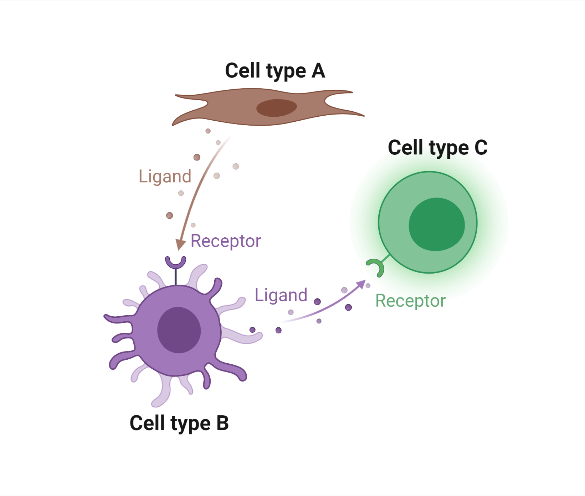

# scTenifoldXct
Manifold learning to detect cell-cell interactions.
<br/>
<p align="center">
    
</p>
<br/>

### Install Dependencies
We suggest first intall dependencies of scTenifoldXct with `conda`:
```shell
git clone https://github.com/cailab-tamu/scTenifoldXct.git
cd scTenifoldXct
conda env create -f environment.yml
conda activate scTenifold
```

### Install scTenifoldXct
Install scTenifoldXct with `pip`:
```shell
pip install git+https://github.com/cailab-tamu/scTenifoldXct.git 
```

or install it manually from source:
```shell
pip install .
```

### Usages

#### Quick Start
The following code runs scTenifoldXct on an example data set in the tutorials:
```python
import scanpy as sc
import scTenifoldXct as st

adata = sc.read_h5ad('data/adata_short_example.h5ad') # load data
xct = st.scTenifoldXct(data = adata, # an AnnData 
                    source_celltype = 'Inflam. FIB', # sender cell type
                    target_celltype = 'Inflam. DC', # receiver cell type
                    obs_label = 'ident', # colname in adata.obs indicating cell types
                    rebuild_GRN = True, # whether to build GRNs
                    GRN_file_dir = 'Net_example_dev',  # folder path to GRNs
                    verbose = True, # whether to verbose the processing
                    n_cpus = -1) # CPU multiprocessing, -1 to use all
emb = xct.get_embeds(train = True) # Manifold alignment to project data to low-dimensional embeddings
xct_pairs = xct.null_test() # non-parametric test to get significant interactions
print(xct_pairs)
```

### Tutorial
We have included two tutorial notebooks on scTenifoldXct usage and results visualization.

Single-sample interaction analysis:<br> https://github.com/cailab-tamu/scTenifoldXct/blob/master/tutorials/tutorial-short_example.ipynb <br>
Two-sample differential interaction analysis:<br> https://github.com/cailab-tamu/scTenifoldXct/blob/master/tutorials/tutorial-merge_short_example.ipynb 
<br/>

### Run scTenifoldXct from command-line by Docker
scTenifoldXct provides command-line utilities for users who are not familiar with Python.<br>
A Docker image of scTenifoldXct can be built from the repository. The Docker image has all required packages and databases included. 

```shell
docker build -t sctenifold .
docker run -it --name xct --shm-size=8gb sctenifold
```
If successful, a Bash terminal will be present in the newly created container.<br>
An example for running single-sample analysis:
```shell
python -m scTenifoldXct.core tutorials/data/adata_short_example.h5ad \
--rebuild \
-s "Inflam. FIB" \
-r "Inflam. DC" \
--n_cpus 8 \
-v
```
For runnning two-sample analysis:
```shell
python -m scTenifoldXct.merge tutorials/data/adata_merge_example.h5ad \
NormalvsTumor N T \
--rebuild \
-s "B cells" \
-r "Fibroblasts" \
--n_cpus 8 \
-v
```
Users should copy their own data to the container for their analyses. 

When analysis completes, hit Ctrl + p and Ctrl + q to detach from the container and then copy the result to the host:
```shell
docker cp xct:/app/xct_results/ .
```

