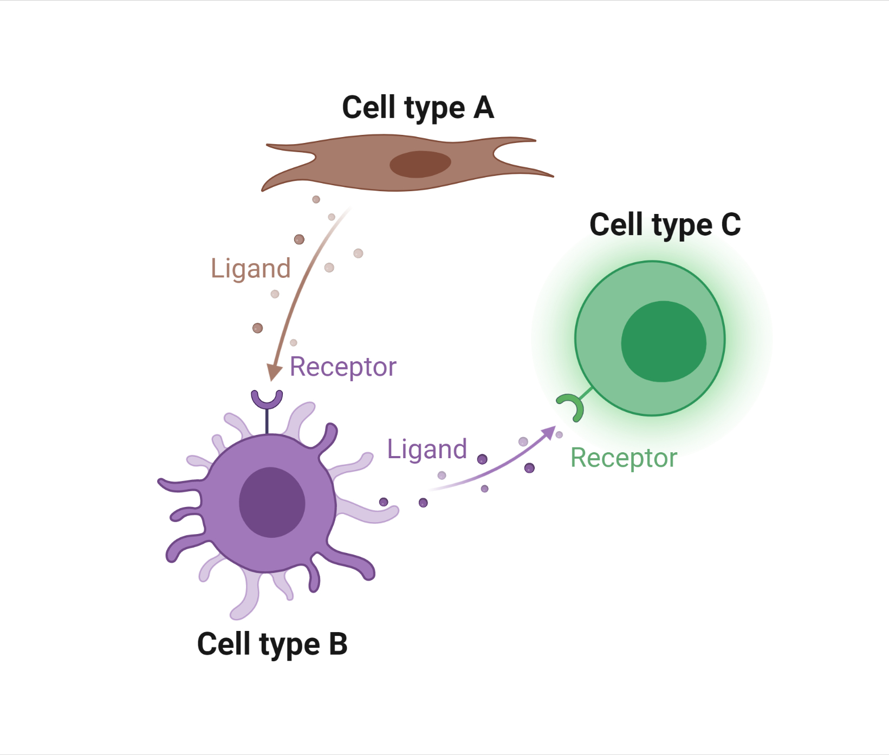

# scTenifoldXct
a semi-supervised method for predicting cell-cell interactions and mapping cellular communication graphs via manifold learning <br> 
<span style="color:red;">New!</span> Data has been added. Feel free to explore and use it. <br>
<span style="color:red;">New!</span> A standalone UI has been added. [Give it a try!](https://sctenifold.streamlit.app/)
[[Paper]](https://doi.org/10.1016/j.cels.2023.01.004)
<br/>
<p align="center">
    
</p>
<br/>

### Install

Install scTenifoldXct from PyPI:
```shell
pip install scTenifoldXct
```

**Install from source** (for development or the latest unreleased changes):
```shell
git clone https://github.com/cailab-tamu/scTenifoldXct.git
cd scTenifoldXct
pip install .
```

### Usages

#### Quick Start
The following code runs scTenifoldXct on the bundled example data set:
```python
import logging
import scanpy as sc
import scTenifoldXct as st

# scTenifoldXct logs progress via the logging module. Configure a handler
# to see messages when verbose=True (e.g. in a script or notebook):
logging.basicConfig(level=logging.INFO, format="%(message)s")

adata = sc.read_h5ad('data/adata_short_example.h5ad') # load data
xct = st.scTenifoldXct(data = adata, # an AnnData
                    source_celltype = 'Inflam. FIB', # sender cell type
                    target_celltype = 'Inflam. DC', # receiver cell type
                    obs_label = 'ident', # colname in adata.obs indicating cell types
                    rebuild_GRN = True, # whether to build GRNs
                    GRN_file_dir = 'Net_example_dev',  # folder path to GRNs
                    verbose = True, # whether to log the processing
                    n_cpus = -1) # CPU multiprocessing, -1 to use all
emb = xct.get_embeds(train = True) # Manifold alignment to project data to low-dimensional embeddings
xct_pairs = xct.null_test() # non-parametric test to get significant interactions
print(xct_pairs)
```

#### Command line
Two console scripts are installed with the package:
```shell
# single-sample interaction analysis
sctenifoldxct data/adata_short_example.h5ad --rebuild \
    -s "Inflam. FIB" -r "Inflam. DC" --n_cpus 8 -v

# two-sample differential interaction analysis
sctenifoldxct-merge data/adata_merge_example.h5ad NormalvsTumor N T \
    --rebuild -s "B cells" -r "Fibroblasts" --n_cpus 8 -v
```
Run `sctenifoldxct --help` or `sctenifoldxct-merge --help` for all options.

### Tutorial
We have included two tutorial notebooks on scTenifoldXct usage and results visualization.

Single-sample interaction analysis:<br> https://github.com/cailab-tamu/scTenifoldXct/blob/main/tutorials/tutorial-short_example.ipynb <br>
Two-sample differential interaction analysis:<br> https://github.com/cailab-tamu/scTenifoldXct/blob/main/tutorials/tutorial-merge_short_example.ipynb 
<br/>

### Run scTenifoldXct from command-line by `Docker`
scTenifoldXct provides command-line utilities for users who are not familiar with Python.<br>
A Docker image of scTenifoldXct can be built from the repository. The Docker image has all required packages and databases included. 

```shell
docker build -t sctenifold .
docker run -it --name xct --shm-size=8gb sctenifold
```
If successful, a Bash terminal will be present in the newly created container.<br>
An example for running single-sample analysis:
```shell
sctenifoldxct data/adata_short_example.h5ad \
--rebuild \
-s "Inflam. FIB" \
-r "Inflam. DC" \
--n_cpus 8 \
-v
```
For running two-sample analysis:
```shell
sctenifoldxct-merge data/adata_merge_example.h5ad \
NormalvsTumor N T \
--rebuild \
-s "B cells" \
-r "Fibroblasts" \
--n_cpus 8 \
-v
```
Users should copy their own data to the container for their analyses. 

When analysis completes, hit Ctrl + p and Ctrl + q to detach from the container and then copy the result to the host:
```shell
docker cp xct:/app/xct_results/ .
```


