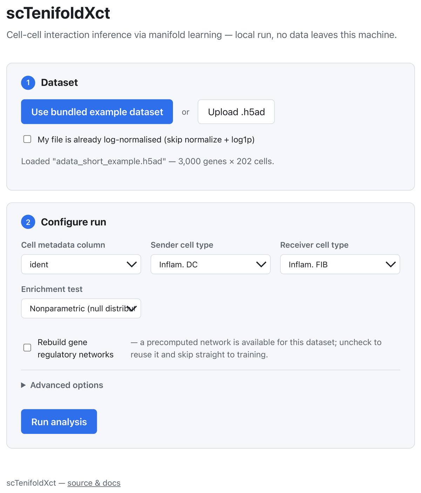
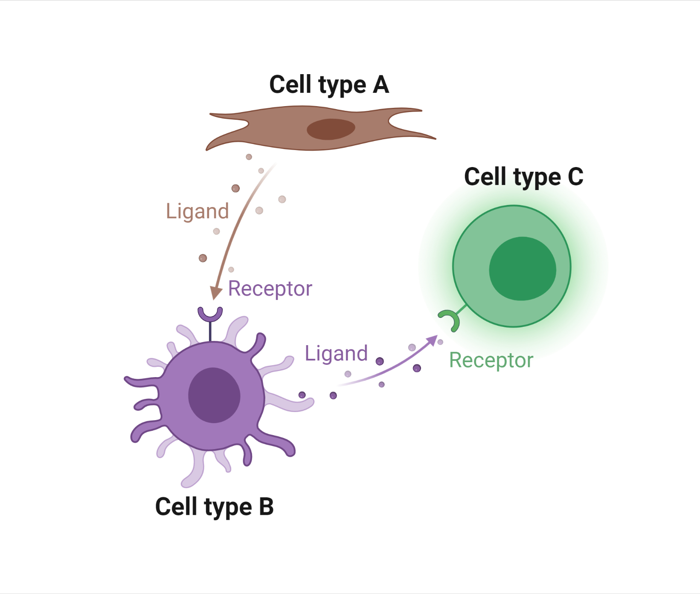

# scTenifoldXct

[](https://pypi.org/project/scTenifoldXct/)
[](https://opensource.org/licenses/MIT)
[](https://doi.org/10.1016/j.cels.2023.01.004)

A semi-supervised method for predicting cell-cell interactions and mapping cellular communication graphs via manifold learning. [[Paper]](https://doi.org/10.1016/j.cels.2023.01.004)

> 🆕 **New: a local web UI.** No code required — see [Web UI](#web-ui) below, or try the hosted
> [Streamlit demo](https://sctenifold.streamlit.app/).

<p align="center">
    
</p>

<p align="center">
    
</p>
<br/>

### Install

```shell
pip install scTenifoldXct
```

**From source** (development or latest unreleased changes):
```shell
git clone https://github.com/cailab-tamu/scTenifoldXct.git
cd scTenifoldXct
pip install .
```

### Example Data
Two real, ready-to-use datasets are bundled under [`data/`](data/) — no data of your own required:

| File | Shape | Cell types (`ident`) | Used by |
|---|---|---|---|
| [`adata_short_example.h5ad`](data/adata_short_example.h5ad) | 202 cells × 3,000 genes | `Inflam. FIB`, `Inflam. DC` | single-sample analysis (`sctenifoldxct` / `st.scTenifoldXct`) |
| [`adata_merge_example.h5ad`](data/adata_merge_example.h5ad) | 199 cells × 2,608 genes | `B cells`, `Fibroblasts` (across `NormalvsTumor` conditions `N`/`T`) | two-sample differential analysis (`sctenifoldxct-merge`) |

Both are log-normalised and ready to feed straight into the examples below. See
[`data/README.md`](data/README.md) for additional/larger datasets.

### Usages

#### Quick Start
```python
import logging
import scanpy as sc
import scTenifoldXct as st

# scTenifoldXct logs progress via the logging module; configure a handler to
# see messages when verbose=True (e.g. in a script or notebook):
logging.basicConfig(level=logging.INFO, format="%(message)s")

adata = sc.read_h5ad('data/adata_short_example.h5ad') # load data
xct = st.scTenifoldXct(data = adata, # an AnnData
                    source_celltype = 'Inflam. FIB', # sender cell type
                    target_celltype = 'Inflam. DC', # receiver cell type
                    obs_label = 'ident', # colname in adata.obs indicating cell types
                    rebuild_GRN = True, # whether to build GRNs
                    GRN_file_dir = 'Net_example_dev',  # folder path to GRNs
                    verbose = True, # whether to log the processing
                    n_cpus = -1) # CPU multiprocessing, -1 to use all
emb = xct.get_embeds(train = True) # Manifold alignment to project data to low-dimensional embeddings
xct_pairs = xct.null_test() # non-parametric test to get significant interactions
print(xct_pairs)
```

#### Command line
```shell
# single-sample interaction analysis
sctenifoldxct data/adata_short_example.h5ad --rebuild \
    -s "Inflam. FIB" -r "Inflam. DC" --n_cpus 8 -v

# two-sample differential interaction analysis
sctenifoldxct-merge data/adata_merge_example.h5ad NormalvsTumor N T \
    --rebuild -s "B cells" -r "Fibroblasts" --n_cpus 8 -v
```
Run `sctenifoldxct --help` or `sctenifoldxct-merge --help` for all options.

#### Web UI
Prefer clicking over scripting? Install the `web` extra and launch a local, point-and-click
interface — no Python knowledge required:
```shell
pip install --no-cache-dir "scTenifoldXct[web]"
sctenifoldxct-ui
# opens http://127.0.0.1:8765
```
Load a dataset (the bundled example needs no upload, from a git checkout — otherwise upload your
own `.h5ad`), pick sender/receiver cell types, and hit **Run analysis**. Ranked ligand-receptor
pairs show up in-browser with a full CSV download. Everything — data, computation, results — stays
on your machine. Run `sctenifoldxct-ui --help` for host/port/GRN-cache options.

### Tutorial
Two tutorial notebooks cover usage and results visualization:

- Single-sample interaction analysis: https://github.com/cailab-tamu/scTenifoldXct/blob/main/tutorials/tutorial-short_example.ipynb
- Two-sample differential interaction analysis: https://github.com/cailab-tamu/scTenifoldXct/blob/main/tutorials/tutorial-merge_short_example.ipynb

### Run scTenifoldXct from command-line by `Docker`
A Docker image with all required packages and databases included, for users not familiar with Python:

```shell
docker build -t sctenifold .
docker run -it --name xct --shm-size=8gb sctenifold
```
This drops you into a Bash terminal in the container. Example single-sample run:
```shell
sctenifoldxct data/adata_short_example.h5ad \
--rebuild \
-s "Inflam. FIB" \
-r "Inflam. DC" \
--n_cpus 8 \
-v
```
Two-sample analysis:
```shell
sctenifoldxct-merge data/adata_merge_example.h5ad \
NormalvsTumor N T \
--rebuild \
-s "B cells" \
-r "Fibroblasts" \
--n_cpus 8 \
-v
```
Copy your own data into the container for your analyses. When done, detach with Ctrl+p Ctrl+q and
copy results back to the host:
```shell
docker cp xct:/app/xct_results/ .
```
